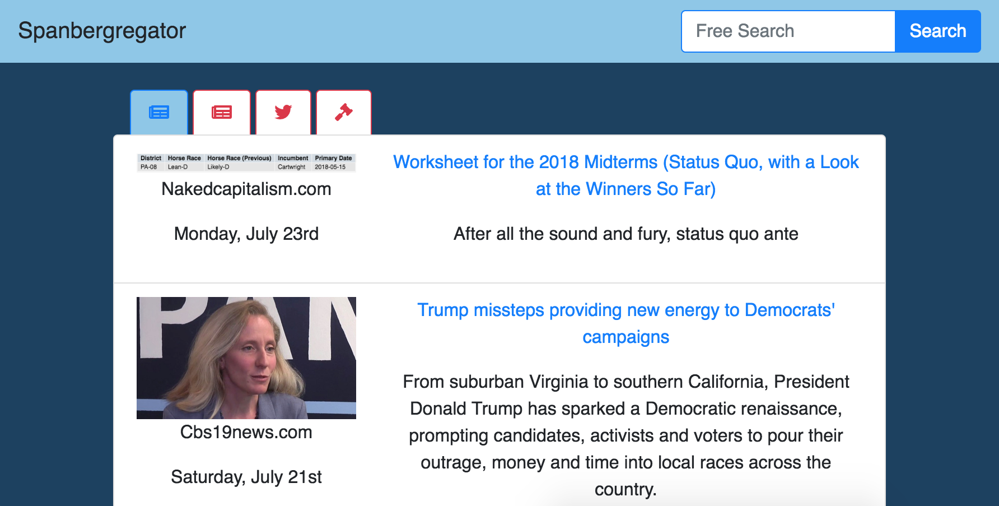
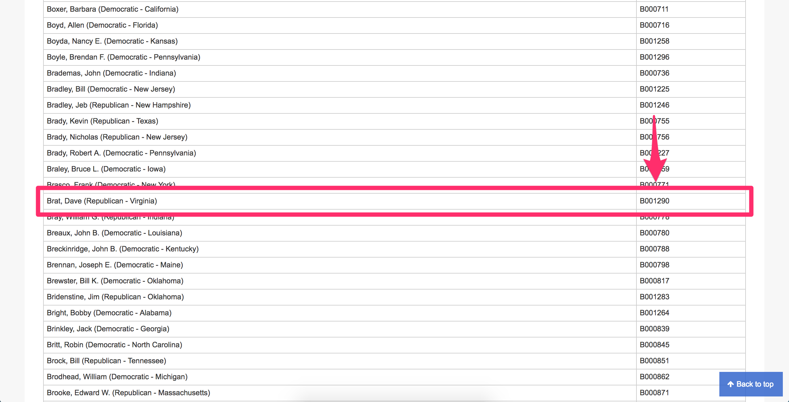
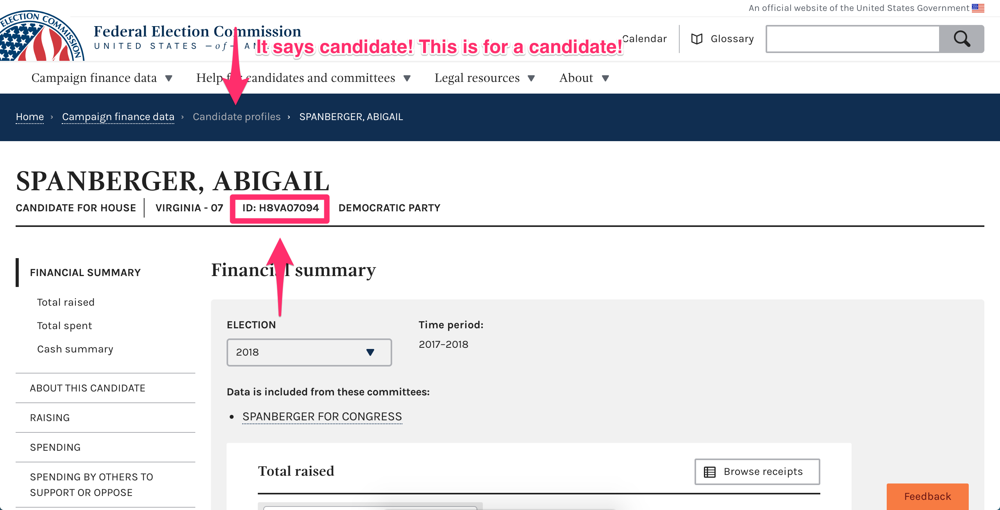
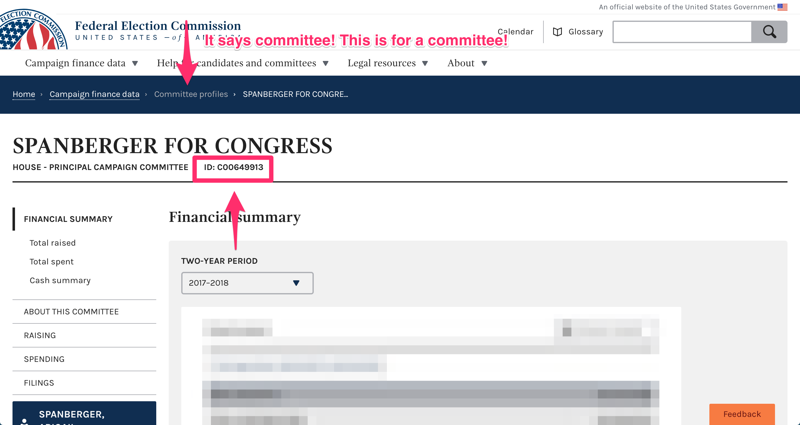
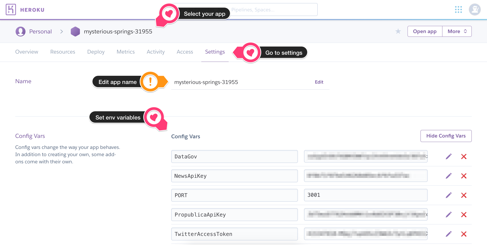

Houly news has was cloned from the below repository.

All things the same except adding a LoginKey to the .env file.

HoulyNews represents Chrissy Houlahan of Pa-06


# Spanbergregator



* [About](#about)
* [Techstack](#techstack)
* [Usage](#usage)
    * [Clone this repo](#clone-this-repo)
    * [Install dependencies](#install-dependencies)
    * [Add environmental variables](#add-environmental-variables)
    * [Add configs for your campaign](#add-configs-for-your-campaign)
        * [What is the member ID?](#what-is-the-member-id-)
        * [What is the FEC ID?](#what-is-the-fec-id-)
        * [What is the committee FEC ID?](#what-is-the-committee-fec-id-)
    * [Run locally](#run-locally)
* [Deploy](#deploy)
    * [Log in to Heroku](#log-in-to-heroku)
    * [Create a Heroku app](#create-a-heroku-app)
    * [Add environmental variables](#add-environmental-variables-1)
    * [Push up changes](#push-up-changes)
* [Contribute](#contribute)


## About

A simple info aggregator for VA-07 campaign. It was built to be flexible and accessible for any campaign.

What it does:

* Collects and displays news articles from **NewsApi** about candidate and opponent
* Collects and displays news articles from **NewsApi** about user input query
* Collects and displays tweets from each candidate's **Twitter** account
  * Highlights retweets in green
  * Highlights quote replies in yellow
  * Highlights replies in red
  * Highlights self-replies in grey
* Collect and display info from **Propublica** about any (currently in Congress) candidate's vote history
  * My campaign is not for an incumbent, so it may be worth adjusting this so the votes are not automatically taken from opponent's page on Propublica
* Collect and display info from **Propublica** about both candidates' financial disclosures

## Techstack

* Created with `create-react-app`
* Styled with `Bootstrap`, `Font-Awesome`
* Using simple `node/express` proxy server for API calls

## Usage

### Clone this repo

```
git clone git@gitlab.com:digidems/spanbergregator.git
cd spanbergregator
```

### Install dependencies

For development purposes this project uses a proxy server, so there are two directories in which you will need to install dependencies, the `root` and `client`.

```
npm i
cd client
npm i
cd ..
```

### Add environmental variables

1. Make a .env file in the `root` directory
    * `/.env`
1. You will need to get API keys for several services
    * [Twitter](https://developer.twitter.com/en/docs.html)
    * [NewsApi](https://newsapi.org/register)
    * [Propublica](https://www.propublica.org/datastore/api/propublica-congress-api)
1. Should contain the following:

```
# General environment stuff

PORT=3001

# Propublica API

PropublicaApiKey=

# NewsApi API

NewsApiKey=

# Twitter API

TwitterConsumerKey=
TwitterConsumerSecret=
TwitterAccessToken=
TwitterAccessTokenSecret=

#Login ID

LoginKey = 

```

### Add configs for your campaign

These terms will be used to search the various APIs used in this app.

Store in:

`/client/src/config.js`

```javascript
export default {
  demName: '',
  demTwitter: '',
  demMemberId: '',
  demFECId: '',
  demCommitteeFECId: '',
  repName: '',
  repTwitter: '',
  repMemberId: '',
  repFECId: '',
  repCommitteeFECId: '',
};
```

#### What is the member ID?

You can find the member ID by [locating the representative here on congress.gov](https://www.congress.gov/help/field-values/member-bioguide-ids).

**ONLY REPRESENTATIVES IN OFFICE WILL HAVE IDS**, as these are literally IDs for congress. If your candidate, or opponent, do not have an ID just leave the value an empty string, or `null`.



#### What is the FEC ID?

You can find the Federal Election Commission (FEC) ID by [searching for the representative here at fec.gov](https://www.fec.gov/) and grabbing it from their profile.



#### What is the committee FEC ID?

You can find the FEC ID of your candidate/opponent's committee [by searching the same site](https://www.fec.gov/)! Just **make sure you get a committee**. The page will look _almost identical_ to the previous FEC page, but you will know based on what KIND of profile you are in!



### Run locally

To run locally just run

```
npm install && start
```

## Deploy

Deploying the aggregator is as simple as pushing once you have a [Heroku](https://www.heroku.com) account.

### Log in to Heroku

First you must login to Heroku on the command line. Make sure you have [installed the Heroku CLI](https://devcenter.heroku.com/articles/heroku-cli).

```
heroku login
```

### Create a Heroku app

Once you are logged into Heroku in your terminal, from the root of this repo you should initialize a new Heroku app.

Replace `<name>` with whatever you want to name your app. Don't worry, you can change this later!

```
heroku create <name>
```

### Add environmental variables

The `.env` file we created earlier is great for use locally. Once we decide to deploy, we must transfer those keys to Heroku. If you are good with a command line, you can [see how to do that here](https://devcenter.heroku.com/articles/getting-started-with-nodejs#define-config-vars). Otherwise there is a GUI you can use on [Heroku.com](https://www.heroku.com).

* Select your app (should have been created when you ran heroku create)
* Go to settings
* Add your environmental variables

You can even change the name of your app here, if you like.



### Push up changes

Finally, you just have to push up your code to Heroku. Creating an app will have added a `heroku` remote to this directory, so every time you make updates all you have to do is commit them and enter this script:

```
git push heroku master
```

The build process is already set up, so once the build finishes you should have a live aggregator!

## Contribute

My wishlist:

* Cache data from API calls to reduce call count
* Group articles that are posted to multiple sources
# houlyNews
